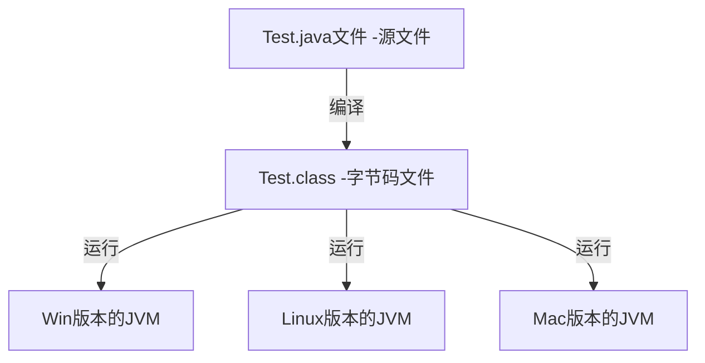

# 
JAVA 基础

## 1.应用领域
- 企业级应用
软件系统、各类网站，如金融、电商领域;
>
- Android平台应用
>
- 移动领域应用
各种小型设备上的应用，包括机顶盒，车载大屏影音娱乐设备，POS机等；

## 2.JAVA特性
- 面向对象的
- 健壮性，强类型机制，有异常处理，垃圾自动回收；
- 跨平台性
- 解释型（编译后的代码，不能直接被机器执行，需要通过解释器执行后），对应编译性语言（c/c++）

## 3.Java运行机制及运行流程

- 核心机制-JVM(JAVA 虚拟机)
a. JVM是一个虚拟的计算机，具有指令集并使用不同的存储区域，负责执行指令，管理数据、内存、寄存器，包含在JDK中；
b. 不同的平台有不同的虚拟机；
c. 虚拟机机制屏蔽了底层运行平台的差别，实现了"一次编译，到处运行"；
>
- JDK 基本介绍
全称JAVA工具包（JAVA Development Kit）
JDK = JRE + JAVA开发工具（java,javac,javadoc,javap等）
>
- JRE 基本介绍
JRE（JAVA Runtime Environment，Java运行环境）
JRE = JVM + JAVA的核心类库
>

## 4.转义字符
- \t 制表位，对齐
- \n 换行
- \\ 一个\
- \" 一个"
- \' 一个'
- \r 一个回车

## 5.文档注释
注释内容可以被JDK提供的工具javadoc所解析，生成一套以网页文件形式体现的该程序的说明文档，一般写在类
/**开头 */结尾
生成文档命令: javadoc -d d:\\temp -author -version Javadoc.java

## 6.代码规范
- 类、方法的注释，要以javadoc的方式来写
- 源文件要使用UTF-8编码
- 代码编写行尾风格/次行风格

## 7.DOS命令