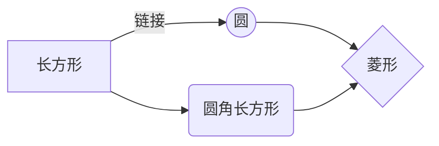

[TOC]  
<!--生成目录 -->
# 一级标题
## 二级标题
### 三级标题
#### 四级标题
##### 五级标题
###### 六级标题  <!--最多6级标题-->

1. 123
2. 234
3. 345  <!--有序列表-->

- 123
- 234
- 345   <!--无序列表-->

**我是粗体** 
*我是斜体*

gray

微软雅黑字体
黑体
楷体
3号字
4号字
红色
绿色
蓝色

<table><tr><td bgcolor=orange> 背景色是 1 orange</td></tr></table>
<table><tr><td bgcolor= BlueViolet > 背景色2 BlueViolet </td></tr></table>

- [ ] 计划任务     
- [x] 完成任务

==标记文本==
~~删除文本~~

---------------------------
项目 | Value
---- | -----
电脑 | $1600 
手机 | $12
导管 | $1
|:--------:| -------------:|

插入Mermaid流程图
--------

撤销：Ctrl/Command + Z
重做：Ctrl/Command + Y
加粗：Ctrl/Command + B
斜体：Ctrl/Command + I
标题：Ctrl/Command + Shift + H
无序列表：Ctrl/Command + Shift + U
有序列表：Ctrl/Command + Shift + O
检查列表：Ctrl/Command + Shift + C
插入代码：Ctrl/Command + Shift + K
插入链接：Ctrl/Command + Shift + L
插入图片：Ctrl/Command + Shift + G

---   
三个才是分割符，且只有符号

>引用1
>>引用2
>>>引用3

